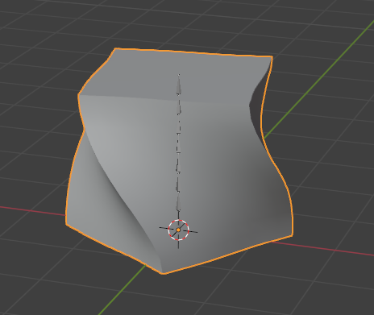
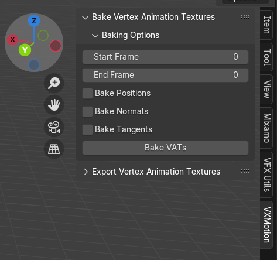
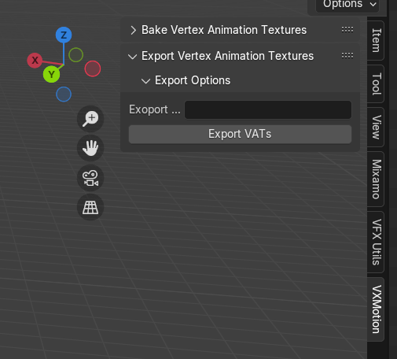

# VXMotion - Blender

VXMotion is a comprehensive toolset tailored for the creation, manipulation, and export of vertex animation textures. 
Designed to be highly versatile, it offers seamless integration between Blender and prominent game engines such as 
Unreal, Unity, and Godot.

This Addon allows you to bake and export Non-Alembic, Skinless animations from different animation workflows:

- Skinned Meshes
- Blend Shapes
- Deformer Modifiers
- Rigid Body Simulations
- Soft Body Simulations
- Cloth Simulations
- Fluid Simulations (Smoke, Fire and Liquid)
- Geometry Nodes
- And (Hopefully) Much More...

---

## How It Works

The majority of the game engines have a standard for only one type of animation: **Skinned Mesh Animations** This is a
great tool for a lot of applications in the game development workflow but is surprisingly limited when it comes to
variable topology or more complex and dynamic mesh deformations. This of course comes from the fact that Game developers always must
have an eye on performance, so complex soft body physics or fluid simulations are more often than not, not an option for
a game.

What a vertex animation texture does is Store all the position, normal and tangent data from the vertices of a mesh each frame in
pixels, given that the RGB channels can be encoded to XYZ coordinates, the translation can be done pretty much directly.
Once The data is stored in the necessary textures, a vertex shader can decode and apply this information as vertex offsets
for each vertex in a base mesh, making the runtime cost of such complex animations just a very small fraction of what it
would take to simulate something like a water splash or a Smoke puff.
---
## Usage Guide

## Baking VATs

### 1. Select your target object
First of all, ensure that your active object is the one you want to bake the VATs for 



### 2. Set Bake Settings

Go to the `VXMotion` tab in the 3D view menu and change the settings according to your needs:



### 3. Baking your textures

After putting on your settings, click the button `Bake VATs`, this should generate a collection of textures associated 
with the selected object, you can view them in the uv editor or for debugging purposes you can find them at `c:/tmp/vat_cache` 

## Exporting VATs

Given the nature of VATs and their direct association with the vertex buffers, a collection o VATs will always be bound
to the base object they were baked for, and thus exporting them requires the object to still exist and the VATs to be
baked previously.

### 1. Select your target object
First of all, ensure that your active object is the one you intend to export with the VATs


### 2. Set Export Settings

Go to the `VXMotion` tab in the 3D view menu and change the settings according to your needs:



### 3. Export your VAT Clip

Hit the `Export` button, this should output a `.vatclip` file to the specified path in the previous settings, this file
is basically a zip file containing:

- Base mesh (OBJ)
- Position textures (EXR)
- Normal textures (EXR)
- Tangent textures (EXR)

### Importing VATs to an engine

Please visit the plugin pages for the supported engines:

- [Unity Engine](https://github.com/Chechol27/vx_motion_unity)
- Unreal Engine
- Godot
- Roblox Studio

Alternatively, you can import your VATs into your preferred software simply by extracting the `.vatclip` as a zip file and
following the software's asset import pipeline with the individual files
---
## Development Guide

If you want to modify this addon, feel free to do so here's a quick start guide for a simpler development process

### 1. Setup your virtual environment

Requirements:
- Python 3.12

A virtual environment is not necessary since all the code will run through blender's own interpreter, but having one may
help with certain IDEs (I'm using pycharm btw).

#### Create your virtual environment:

``` 
cd path/to/this/repo
path/to/your/python/3.12/executable.exe -m venv venv
./venv/scripts/activate
pip install -r "requirements.txt"
```


